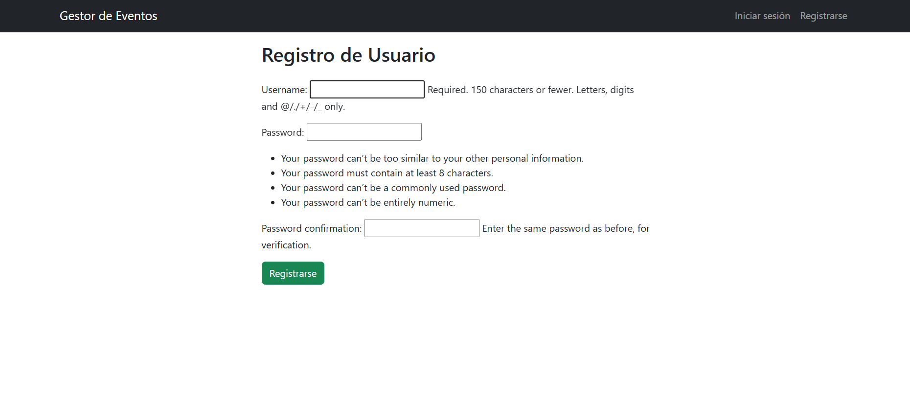
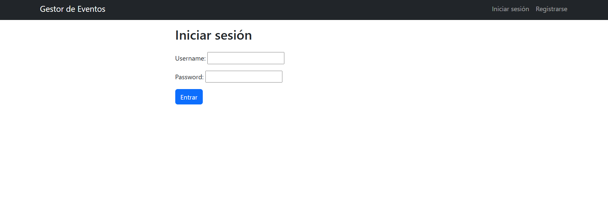
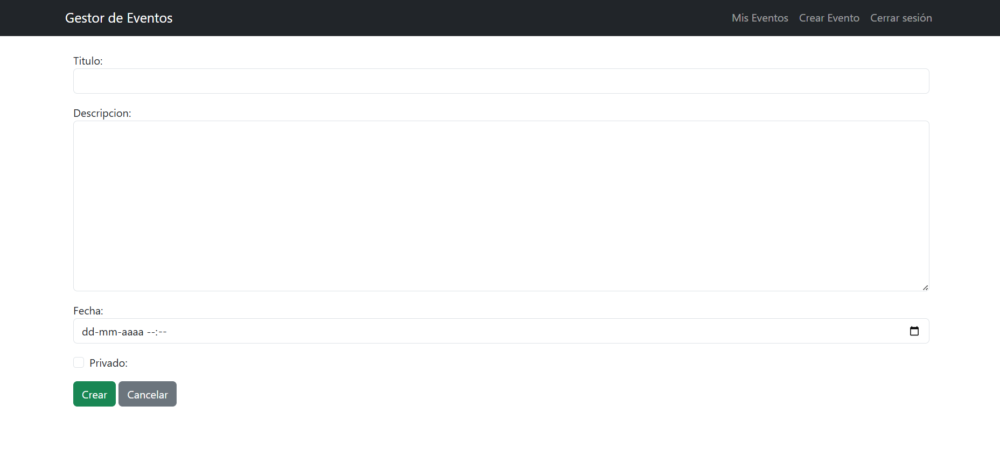
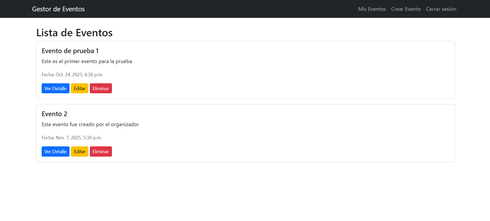
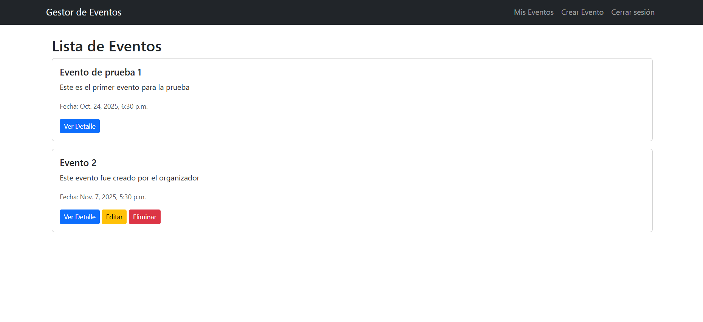
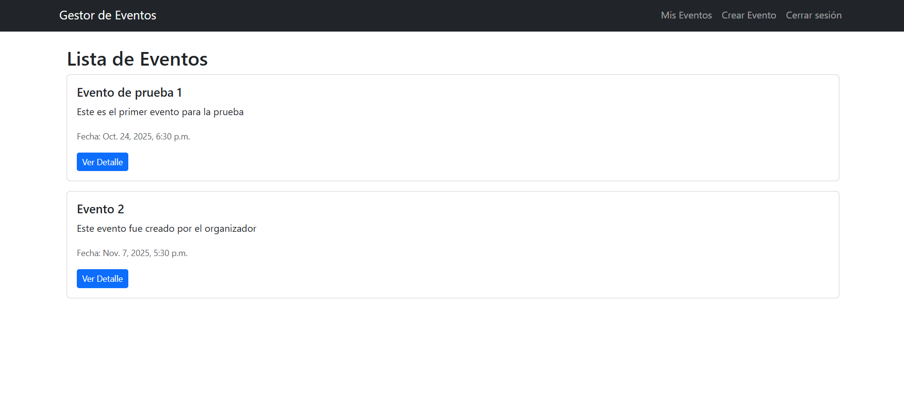

# 🎟️ Gestor de Eventos Django

Aplicación web desarrollada con Django para gestionar eventos con control de acceso basado en roles: **Administrador**, **Organizador** y **Asistente**.

Este sistema permite a los usuarios registrarse, iniciar sesión y visualizar eventos según su rol. Incluye datos de ejemplo para facilitar la demostración.

Repositorio: [EstefanyRodriguezP/gestor-eventos-django](https://github.com/EstefanyRodriguezP/gestor-eventos-django)

---

## 🧩 Funcionalidades principales

- Registro e inicio de sesión de usuarios.
- Roles con permisos:
  - **Administrador**: puede ver, crear, editar y eliminar cualquier evento.
  - **Organizador**: puede ver todos los eventos, pero solo editar/eliminar los suyos.
  - **Asistente**: puede ver eventos públicos y registrarse como asistente.
- Interfaz amigable con Bootstrap.
- Carga automática de datos de ejemplo con fixtures.

---

## ⚙️ Tecnologías utilizadas

- Python 3.12
- Django 5.2
- SQLite (modo desarrollo)
- HTML5, CSS3 (actualmente no se está utilizando) y Bootstrap 5

---

## 🖥️ Requisitos

- Python 3.10 o superior
- pip
- Virtualenv (opcional, pero recomendado)

---

## 🚀 Instalación

1. **Clona el repositorio:**

```bash
git clone https://github.com/EstefanyRodriguezP/gestor-eventos-django.git
cd gestor-eventos-django
```
2. **Crea un entorno virtual:**

```bash
python -m venv venv
# Windows
venv\Scripts\activate
# macOS / Linux
source venv/bin/activate
```
3. **Instala dependencias:**

```bash
pip install -r requirements.txt
```
4. **Ejecuta migraciones:**

```bash
python manage.py migrate
```
5. **Carga los datos de ejemplo (usuarios, grupos y eventos):**

```bash
python manage.py loaddata eventos/fixtures/groups.json
python manage.py loaddata eventos/fixtures/users.json
python manage.py loaddata eventos/fixtures/eventos.json
```
6. **Inicia el servidor de desarrollo:**

```bash
python manage.py runserver
```

---

## 🔐 Usuarios de prueba

| Rol         | Usuario       | Contraseña       |
|-------------|---------------|------------------|
| SuperUser       | `admin`       | `admin`       |
| Admin       | `ana1234`       | `0.123456as`       |
| Organizador | `oscar1234` | `0.123456as` |
| Asistente   | `jose1234`   | `0.123456as`   |

---

## 🗃️ Estructura del proyecto
```bash
gestor_eventos/
├── eventos/
│ ├── fixtures/ # Fixtures de ejemplo (usuarios, grupos, eventos)
│ ├── management/ # Comandos personalizados
│ ├── migrations/ # Migraciones de base de datos
│ ├── templates/ # HTMLs del proyecto
│ ├── admin.py
│ ├── apps.py
│ ├── forms.py
│ ├── models.py
│ ├── urls.py
│ ├── views.py
│ └── ...
├── gestor_eventos/
│ ├── settings.py
│ ├── urls.py
│ └── ...
├── screenshots/ # Capturas de pantalla
├── manage.py
├── README.md
├── requirements.txt
└── .gitignore
```

---

## 🖼️ Capturas de pantalla

- **Registro de Usuario**  
  

- **Inicio de Sesión**  
  

- **Crear Evento**  
  

- **Vista de eventos como Administrador**  
  

- **Vista de eventos como Organizador**  
  

- **Vista de eventos como Asistente**  
  

---

## 📁 Fixtures incluidos

Los datos de ejemplo se encuentran en `eventos/fixtures/`:

- `groups.json`: Grupos y permisos.
- `users.json`: Usuarios de prueba y sus roles.
- `eventos.json`: Eventos públicos y privados de muestra.

---

## 🧑‍💻 Autor

**Estefany Rodríguez**  
Proyecto desarrollado como parte del Bootcamp Desarrollador Full Stack Python.

---
## 📄 Licencia

Este proyecto es de uso libre con fines educativos o personales.
